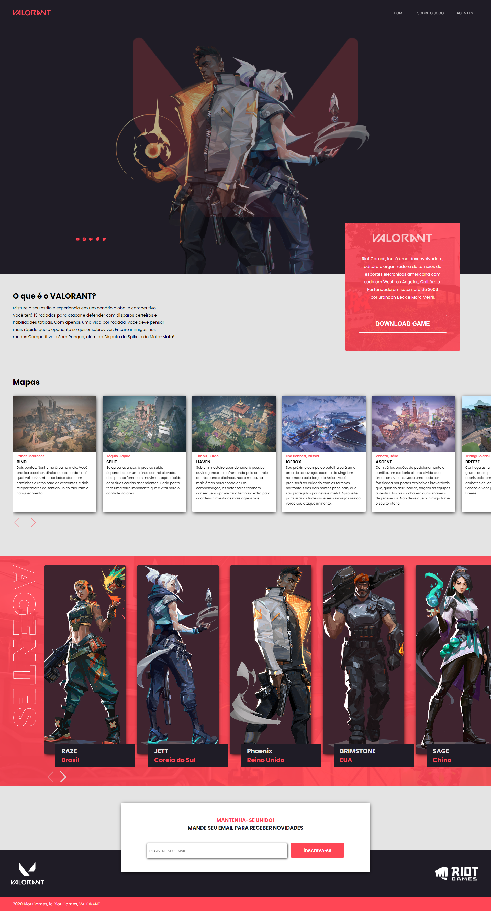

# Valorant Landing Page
## A Valorant game landing page for a college assignment

## 💻 Preview
  

## 👨‍💻 This project was developed with the following technologies:

### HTML
HTML (HyperText Markup Language) is the most basic building block of the Web. It defines the meaning and structure of web content. Other technologies besides HTML are generally used to describe a web page's appearance/presentation (CSS) or functionality/behavior (JavaScript).

Website: https://developer.mozilla.org/en-US/docs/Web/HTML

### CSS
Cascading Style Sheets (CSS) is a stylesheet language used to describe the presentation of a document written in HTML or XML (including XML dialects such as SVG, MathML or XHTML). CSS describes how elements should be rendered on screen, on paper, in speech, or on other media.

Website: https://developer.mozilla.org/en-US/docs/Web/CSS

### Javascript 
JavaScript (JS) is a lightweight, interpreted, or just-in-time compiled programming language with first-class functions. While it is most well-known as the scripting language for Web pages, many non-browser environments also use it, such as Node.js, Apache CouchDB and Adobe Acrobat. JavaScript is a prototype-based, multi-paradigm, single-threaded, dynamic language, supporting object-oriented, imperative, and declarative (e.g. functional programming) styles. Read more about JavaScript.

Website: https://developer.mozilla.org/en-US/docs/Web/JavaScript

### Phosphor Icons
Phosphor is a flexible icon family for interfaces, diagrams, presentations

Website: https://phosphoricons.com/

### Swiper 
Swiper is the most modern free mobile touch slider with hardware accelerated transitions and amazing native behavior. It is intended to be used in mobile websites, mobile web apps, and mobile native/hybrid apps.

Website: https://swiperjs.com/

 ## 🔖 Layout

- This project was developed using [Figma](https://www.figma.com/) 

Look at the prototype in this link: [Valorant Landing Page]( https://www.figma.com/file/aLcb6uwnWVJKlnI9CU0VO2/Valorant-Landing-Page?node-id=0%3A1)

## Usage

### Site

Simply go to the website https://valorant-landing-page.vercel.app/ wherever you want, it can be on your cell phone, notebook, desktop or even on TV!

## Installation

### GIT

- Install git on your machine: https://git-scm.com/downloads
- With git installed on your machine, clone the repository using the **Code** button at https://github.com/Mateus-Kent/valorant-landing-page.git